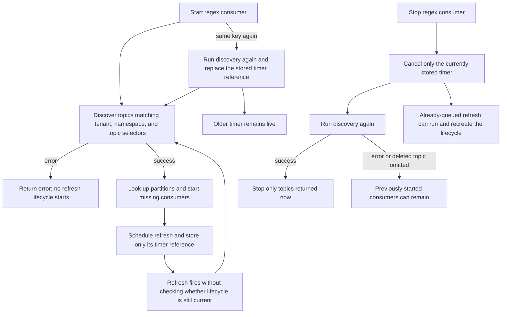
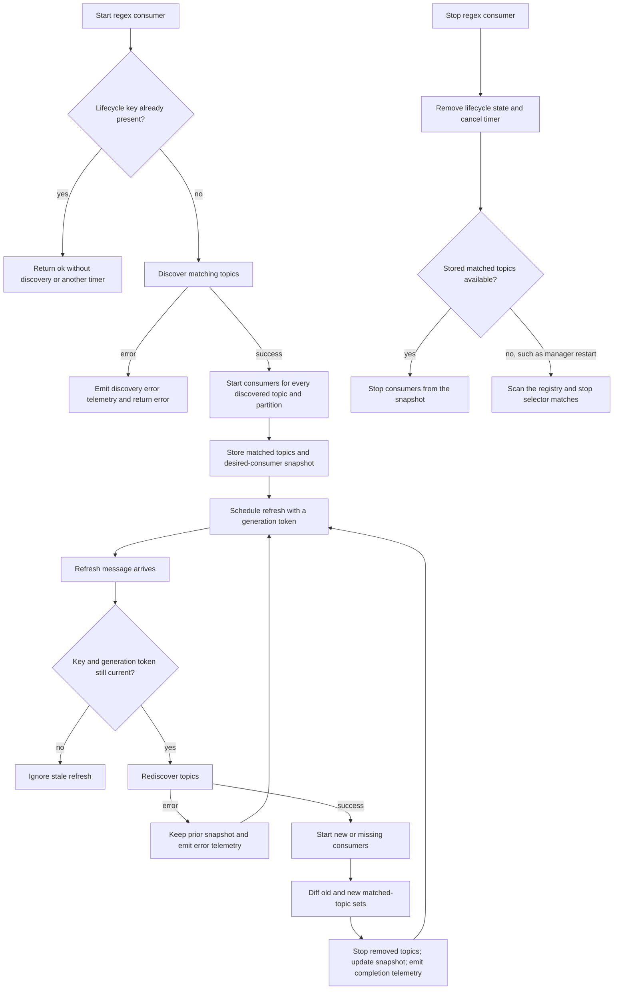
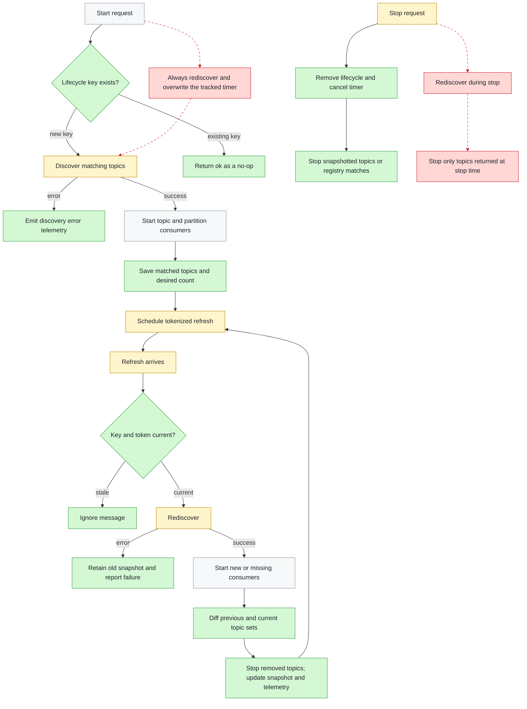
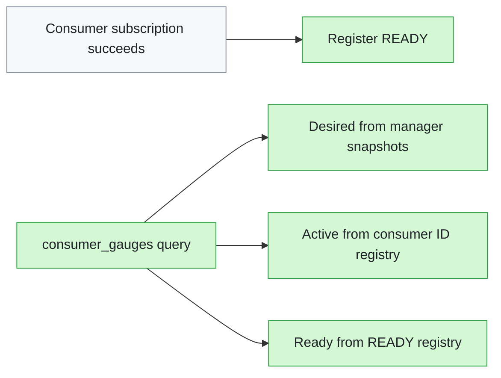

# Stateful regex-consumer lifecycle — before & after

**Scope:** `uncommitted working tree` (tracked and untracked changes present before this document was generated)
**Core files:** `lib/pulsar_ex/consumer_manager.ex`, `lib/pulsar_ex/consumer.ex`, `lib/pulsar_ex/application.ex`, `lib/pulsar_ex.ex`, `lib/pulsar_ex/admin.ex`, `lib/pulsar_ex/partition_manager.ex`

The change turns regex-based consumer discovery from a stateless periodic restart attempt into a reconciled lifecycle. The manager now remembers matched topics, rejects duplicate starts, ignores stale refresh messages, stops topics that disappear, and exposes lifecycle telemetry and consumer gauges.

| Area | What changed | Review effort |
|---|---|---|
| `lib/pulsar_ex/consumer_manager.ex` | Lifecycle state, topic reconciliation, race-safe timers, stop fallback, telemetry, desired counts | highest |
| `lib/pulsar_ex/consumer.ex` and `lib/pulsar_ex/application.ex` | READY registration | medium |
| `lib/pulsar_ex.ex` | Desired/active/ready gauge API | low |
| `lib/pulsar_ex/admin.ex` and `lib/pulsar_ex/partition_manager.ex` | Admin helpers/body handling and configurable partition watch interval | supporting |
| `config/`, `test/`, `mix.exs`, `.gitignore` | Integration/load configuration, test doubles, and expanded lifecycle/load coverage | verification |

## Before

Discovery could start newly appearing topics, but it did not retain enough state to reconcile removals or protect the lifecycle from duplicate and stale timers.

## After

The manager owns an explicit lifecycle keyed by the consumer pattern, including a matched-topic snapshot and a refresh-generation token.

## What changed

The old timer-only paths are red and dotted. The new state and validation steps are green; yellow nodes retain their role but now operate with lifecycle state and telemetry.

**Legend** — 🟩 added · 🟥 removed · 🟨 modified · ⬜ unchanged.  
Dotted red edges are lifecycle paths that no longer exist.

## Zoom: consumer gauges

A consumer registers as ready only after a successful subscription. The gauge API
combines that registry state with active consumer IDs and manager snapshots.

## Notes

- Exact-topic consumers share the new tokenized refresh protection and desired-count snapshots, but topic-set reconciliation applies only to regex discovery.
- On refresh discovery failure, the previous matched-topic set and desired snapshot are retained; the manager reports the error and schedules the next refresh.
- The diagram omits the new integration/load harness and most test-support modules. Those files verify discovery, partition fanout/expansion, deletion, duplicate starts, stop races, telemetry, gauges, and load behavior rather than adding production control-flow steps.
- `lib/pulsar_ex/admin.ex` also adds partitioned-topic update/delete helpers and fixes response-body consumption in existing admin calls; these are independent supporting changes and are not shown in the lifecycle graph.
